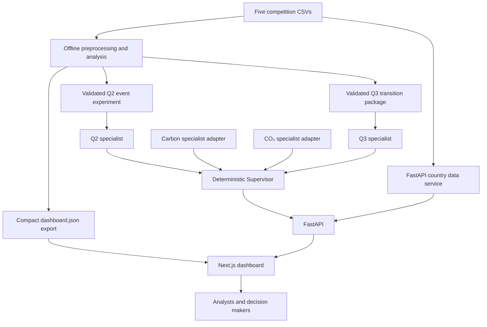

# Monsoon Mandate

**Dashboard: Helios Pane | Analytical assistant: Briefwright**

**CodeFest Datathon 2026 · Final Round**  
A climate and energy intelligence dashboard built from the five supplied competition datasets and the team's own analysis outputs.

Monsoon Mandate helps an analyst answer four questions: **What changed? Why might it matter? What do the validated models or scenarios show? What should be investigated next?** It brings carbon markets, climate events, emissions, energy mix, and transition scenarios into one presentation workflow.

> **Read this distinction first:** An *observed value* comes from a competition CSV. An *analysis export* was calculated previously from those CSVs. A *Q3 pathway* is a conditional deterministic scenario. A *live specialist prediction* would come from a trained model connected to FastAPI. The live Carbon and CO₂ specialist agents are **not connected yet**. The interface shows that state rather than inventing a prediction.

## Presentation in 60 seconds

1. **Overview:** See the latest available carbon and energy picture.
2. **Carbon Price Forecast:** Inspect historical prices and the separately generated 30 trading day analysis export. The live Carbon agent is still awaiting integration.
3. **Climate Events:** Compare an actual baseline Ridge model with an event-aware Ridge model. The measured RMSE gain is small; the result is reported honestly.
4. **CO₂ & Energy:** Inspect observed country emissions and energy shares, then show how a custom mix will use the CO₂ specialist once its final model is connected.
5. **2030 Simulator:** Compare the validated Q3 BAU, Moderate, and Accelerated **CO₂ per person** pathways for a representative country. Show the assumptions and the selected forecast year.
6. **Country Explorer / Model Results:** Show transition archetypes, evidence, coverage, and the difference between scenario analysis and a trained prediction model.
7. **Business Case:** Explain the users and the commercial delivery options.

The recommended live demo country for Q3 is **Algeria**. It has both an archetype and annual scenario outputs. **Germany** is a useful transparency example: it has an archetype and observed history, but the supplied Q3 package has no validated annual scenario for it.

## Current capability and status

| Capability | Current source | Current state |
| --- | --- | --- |
| Observed carbon prices, events, CO₂, energy mix, temperature context | Five supplied CSVs | Available |
| Carbon price forecast shown in the dashboard | `dashboard/public/data/dashboard.json`, generated from competition data | Available as an **earlier analysis export**; live Carbon agent disconnected |
| Q1 team carbon forecast package | `backend/data/carbon/` and the delivered Q1 package | Files present; trained artifacts are **not wired into the live Carbon agent** |
| Climate event feature experiment | Validated Q2 files in `backend/data/q2/` | Available through FastAPI |
| Country transition archetypes | Validated Q3 file in `backend/models/q3/` | Available for all 50 countries through FastAPI |
| BAU / Moderate / Accelerated pathways | Validated Q3 annual scenario file | Available for **six representative countries only** |
| Observed country CO₂ and energy data | Original annual CSVs through FastAPI | Available for 50 countries |
| Live XGBoost prediction from an arbitrary energy mix | CO₂ specialist agent | XGBoost artifact absent; `model_not_connected` until the trained model is integrated |
| Custom plan versus validated future energy baseline | CO₂ specialist plus baseline service | Awaiting the final model and validated baseline energy mix |
| Climate Intelligence Assistant | Deterministic browser-side query layer over the dashboard export, with Q2 summary context | Available; it does not call an LLM and should not be presented as the Q3 API |

The existing generated export still contains older empirical analogue scenario values for legacy analysis. **The visible 2030 Simulator and Country Explorer use the validated Q3 layer for standard future pathways.** Do not use the older export as evidence for a Q3 result.

## Data provenance

Only competition CSVs and results derived from them are used as analytical data. The files under `Dataset/` are:

| Dataset | Rows | Columns | Role |
| --- | ---: | ---: | --- |
| `carbon_prices_daily.csv` | 15,866 | 5 | Observed prices in California, China ETS, EU ETS, RGGI, and UK ETS |
| `climate_events.csv` | 50 | 11 | Dated climate and policy events |
| `co2_emissions_yearly.csv` | 1,350 | 8 | Annual total CO₂, CO₂ per person, intensity, and population for 50 countries, 2000–2026 |
| `energy_mix_yearly.csv` | 1,350 | 14 | Annual energy source shares for the same 50 countries, 2000–2026 |
| `temperature_anomaly_monthly.csv` | 2,528 | 7 | Temperature anomaly and atmospheric CO₂ context; several optional fields are missing in the source |

These counts were checked against the files in this workspace. Missing source fields are not filled with invented values. `build_data.py` creates the compact browser export at `dashboard/public/data/dashboard.json`; it does not replace the original CSVs.

### Units used throughout the product

| Unit | Meaning | Used for |
| --- | --- | --- |
| **Mt CO₂** | Million tonnes of total emissions | Observed country total-emissions charts |
| **t CO₂/person** | Tonnes of emissions per resident | Observed per-person CO₂, Q3 pathways, CO₂ specialist target |
| **%** | Energy share or model error percentage, as labeled | Mix inputs, renewable/fossil shares, MAPE |
| **percentage points** | Difference between two percentages | Change in energy source share, scenario rate assumptions |

The Q3 pathway chart joins historical `co2_per_capita_t` with future `co2_per_capita_t`. It never places per-person values on an Mt axis. The eight editable energy shares must total approximately 100% before a custom request is sent.

## Architecture

### Technology

- **Dashboard:** Next.js 14, React 18, TypeScript, Tailwind CSS, the existing shadcn-based project styling, Recharts, and Lucide icons.
- **Backend:** Python, FastAPI, Pydantic request/response validation, deterministic Supervisor routing, and specialist adapters.
- **Data layer:** Original competition CSVs, a compact JSON export for existing dashboard views, and validated Q2/Q3 CSV/JSON analysis packages.
- **Assistant:** Local rule-based language understanding and arithmetic. It has no hosted model dependency.

### How the current build was assembled

1. Inspected the initialized dashboard and preserved its application shell, visual language, and user-facing navigation.
2. Inspected the five original CSVs and generated a compact dashboard export with `build_data.py` for fast chart rendering.
3. Added a FastAPI backend, structured schemas, energy-mix validation, a deterministic Supervisor, and isolated Carbon/CO₂ agent contracts.
4. Connected observed country data directly to FastAPI while keeping model estimates separate from measurements.
5. Added an editable energy plan with automatic share balancing, explicit submission, loading states, and safe missing-model responses.
6. Integrated the delivered Q2 event experiment through a validated data service, specialist, Supervisor routes, and dashboard results.
7. Inspected and validated the delivered Q3 package before integration; added its service, specialist, API routes, country archetypes, global transition views, and six-country scenario pathways.
8. Changed the simulator's standard-path chart to CO₂ **per person** so its observed and projected series share a unit; retained the custom CO₂ specialist as a separate feature.
9. Added backend and frontend validation checks, then verified the production build.

This sequence matters because it keeps the original datasets, offline analysis, live model interfaces, and presentation UI independently inspectable.



The Supervisor routes a structured task to a specialist. It does not train a model or use an LLM. The Q2 and Q3 specialists serve validated analysis outputs. The Carbon and CO₂ agents are stable integration points for models delivered by teammates; they currently return safe development states.

**No OpenAI, Gemini, Claude, external LLM API, or pretrained NLP model is part of the application.** The assistant uses normalization, keyword and synonym groups, entity extraction, weighted intent scoring, structured lookup, calculations, and response templates.

## Analytical work behind the pages

### Q1 · Carbon markets

The five market histories come from `carbon_prices_daily.csv`. The dashboard's existing export includes previously generated market-specific random forest forecasts, historical values, and evaluation metrics. Its forecast bands are approximate; they are not calibrated 30-step prediction intervals. The delivered Q1 package also contains ARIMA model artifacts and validation files under the Q1 package and `backend/data/carbon/`. Those artifacts are **not the connected FastAPI Carbon agent**. The page labels the export and live-agent state separately.

The intended live route is `POST /api/carbon/forecast` → Supervisor → CarbonForecastAgent. Until the final adapter is connected, the route returns `model_not_connected` without a fake price, RMSE, or MAPE.

### Q2 · Do climate and policy events add predictive value?

The team's Q2 experiment uses **Ridge Regression** for both baseline and event-aware models. The event-aware version adds prior-event counts, severity, policy/weather/disaster counts, and recency features. It does **not** use future unscheduled events as predictive features. The display service cross-checks the Q2 comparison CSV against the summary JSON before returning values.

| Untouched test metric | Baseline | Event-aware | Reading |
| --- | ---: | ---: | --- |
| RMSE | 1.858455 | 1.858013 | About **0.0238%** lower with events |
| MAE | 1.329678 | 1.334222 | Slightly higher with events |
| MAPE | 2.258625% | 2.274982% | Slightly higher with events |

These are the values in `backend/data/q2/README_Q2.txt` and `q2_dashboard_summary.json`. The honest conclusion is that event features provided **negligible improvement** for short-term price-level prediction in this experiment. The event relationship is predictive context, **not proof that an event caused a price move**. The pooled Q2 comparison covers markets quoted in different currencies, so its pooled RMSE must not be described as an EU ETS EUR-only error.

### Q3 · Energy transition and conditional 2030 pathways

The supplied Q3 package was delivered under `backend/models/q3/` rather than the initially expected `backend/data/q3/`. Its eight files were inspected before integration. The service validates 50 country names against the original emissions and energy files, complete 2000–2026 global trend years, archetype counts, complete annual scenario grids, and agreement between annual 2030 values and the separate 2030 summary.

Q3.1 groups country transition fingerprints using **KMeans**. The supplied counts are **BAU 20, Moderate 15, Accelerated 15**. This is a transition classification, not a future CO₂ prediction.

Q3.2 provides **conditional scenario pathways** in t CO₂/person for six representative countries: Algeria, Argentina, Belgium, Czech Republic, Turkey, and Venezuela. The annual file covers 2026–2030. Its assumptions are:

| Scenario | Annual rate assumption |
| --- | --- |
| BAU / Current Trend | Continue that country's 2018–2026 CO₂/person CAGR |
| Moderate / Moderate Renewable Growth | BAU rate minus **1.5 percentage points** |
| Accelerated / Fast Renewable Growth | BAU rate minus **3.5 percentage points** |

These are deterministic pathways under stated assumptions. They are **not probability forecasts**, guaranteed outcomes, or the Q1.2 energy-mix regression model. The other 44 countries still show their archetype and observed history, while the scenario API returns `scenario_not_available`.

### Q1.2 · Energy mix to CO₂ per person

The observed country profile is read by FastAPI from `co2_emissions_yearly.csv` and `energy_mix_yearly.csv`. The separate CO₂ specialist contract targets `co2_per_capita_t` from an eight-share energy mix. The final teammate model, preprocessing pipeline, exact feature order, and metrics must be connected inside `backend/agents/co2_agent.py`. Until then, the predicted KPI says **Awaiting model**. A custom energy mix is submitted only after a user clicks **Predict CO₂** or **Run Simulation**.

The 2030 Simulator's custom energy plan is **not powered by Q3**. Its comparison endpoint needs the CO₂ specialist and a validated future baseline energy mix for the selected year. It cannot produce a valid custom pathway from the Q3 CSV alone.

## Sidebar guide

| Section | Question it answers | What it displays now |
| --- | --- | --- |
| **Overview** | What is the current situation? | Carbon export summary, observed renewable share, country coverage, key charts |
| **Carbon Price Forecast** | Where might a chosen market price go over 30 trading days? | Observed history and existing analysis export; live specialist state clearly labeled |
| **CO₂ & Energy** | What are a country's observed emissions and energy shares? | Real CSV-backed country KPIs and charts, Q3 transition status, custom mix controls, safe model-unavailable state |
| **Climate Events** | Did event features improve carbon-price prediction? | Q2 baseline/event-aware scores, features, event windows, and interpretation |
| **2030 Simulator** | How do the validated transition pathways differ? | Historical per-person CO₂, Q3 paths for six countries, 2027–2030 year selector, assumptions, separate custom model state |
| **Country Explorer** | What changed in a selected country? | Observed energy and emissions, Q3 archetype and transition changes; Q3 2030 values only when supplied |
| **Sovereign Brief** | What evidence is available for a country decision? | Observed country indicators, Q3 status/scenarios, global temperature context, geographic event matches, and delivered Q1 ARIMA market outlook |
| **Model Results** | What methods and evidence support the analysis? | Existing model export scores, Q2 experiment, Q3 methodology, global trend and country-fingerprint views |
| **Business Case** | Who could use this and how? | Problem, target customers, modules, and possible subscriptions, API access, or licensing |
| **Data & technical → Data Quality** | What data are available and where did they come from? | Dataset coverage and missing-value context |
| **Briefwright** | Can a judge ask a natural-language data question? | Deterministic responses over the browser export, with source context and no external LLM |

## Run locally

Use **two PowerShell terminals** from the repository root. Python, Node.js, and npm must be installed. The dashboard's default API base URL is `http://localhost:8000`.

### Terminal 1 · FastAPI

```powershell
python -m pip install -r backend/requirements.txt
python -m uvicorn backend.main:app --reload --host 127.0.0.1 --port 8000
```

### Terminal 2 · Next.js

```powershell
cd dashboard
npm install
npm run dev
```

Open the dashboard at `http://localhost:3000`, API health at `http://127.0.0.1:8000/health`, and interactive API docs at `http://127.0.0.1:8000/docs`.

Set a different backend URL by copying `dashboard/.env.example` to `dashboard/.env.local` and changing `NEXT_PUBLIC_API_BASE_URL`; then restart Next.js. The dashboard export is already present. To regenerate it from the supplied CSVs, run `python build_data.py` from the repository root before starting Next.js. **Regeneration affects the earlier analysis export; it does not replace the validated Q2/Q3 packages or connect either live specialist.**

### If port 8000 is already in use

First check `http://127.0.0.1:8000/health`; a backend may already be running. In PowerShell, inspect the listener with:

```powershell
Get-NetTCPConnection -LocalPort 8000 -State Listen | Select-Object LocalAddress,LocalPort,OwningProcess
```

If you use another port, update `NEXT_PUBLIC_API_BASE_URL` in `dashboard/.env.local` to the same port and restart Next.js. A running backend started before Q3 integration also needs a restart to expose `/api/q3/*`.

## API contracts at a glance

| Route | Purpose |
| --- | --- |
| `GET /health` | Backend health and live Carbon/CO₂ model connection states |
| `GET /api/countries` | Country names from the original competition datasets |
| `GET /api/countries/{country}/energy-co2` | Observed annual CO₂ and energy data |
| `POST /api/carbon/forecast` | Live Carbon specialist contract; currently safe missing-model state |
| `POST /api/co2/predict` | Live CO₂ specialist contract; currently safe missing-model state |
| `POST /api/scenario/compare` | Custom energy plan comparison; requires the CO₂ specialist and validated baseline |
| `GET /api/q2/summary` and `/api/q2/*` | Validated climate-event model experiment |
| `GET /api/q3/summary` | Q3 counts, methods, representative countries |
| `GET /api/q3/global-trends` | 2000–2026 global energy transition series |
| `GET /api/q3/archetypes` | All 50 country fingerprints and archetype summary |
| `GET /api/q3/scenario-countries` | Six countries with validated annual pathways |
| `GET /api/q3/countries/{country}/transition` | One country's Q3 classification and measured changes |
| `GET /api/q3/countries/{country}/scenarios` | Annual BAU/Moderate/Accelerated values when supplied |
| `GET /api/q3/countries/{country}/2030` | Supplied compact 2030 comparison when available |

Q3 responses for unsupported scenario countries use `scenario_not_available`; missing live models use `model_not_connected`. These are expected structured states, not fabricated zero forecasts.

## Test and verify

From the repository root:

```powershell
python -m unittest discover -s backend/tests -v
cd dashboard
npm run test:assistant
npm run test:energy-mix
node tests/scenario-flow.cjs
npm run build
```

At the time of this README update, **25 backend tests**, **81 varied assistant queries plus 3 context checks**, the energy-mix checks, the scenario-flow checks, and a Next.js production build passed. The Q3 backend tests compare the API against the supplied 2030 CSV for all six scenario countries and verify that Germany receives an unavailable scenario state.

For browser-level checks, use [MANUAL_TESTING.md](MANUAL_TESTING.md) and the more complete [TEST_PLAN.md](TEST_PLAN.md). During a presentation rehearsal, verify these five points in Chrome Network and on screen:

1. `GET /health` returns `status: ok`; `not_connected` for a live specialist means the API is working but the final model is absent.
2. Algeria's `GET /api/q3/countries/Algeria/scenarios` returns 2026–2030 BAU, Moderate, and Accelerated arrays. The simulator's selected-year cards use those values without hiding other forecast years.
3. Germany's transition endpoint works, while its scenario endpoint says `scenario_not_available`; no future line or number is invented.
4. A changed custom energy mix goes in the `POST /api/scenario/compare` payload. Today the response is `model_not_connected`; a changing slider alone is not proof of a changing prediction.
5. The Q3 chart says **t CO₂/person**, and observed total-emissions charts say **Mt CO₂**.

## A 10-minute judge walkthrough

| Time | Show | What to say |
| --- | --- | --- |
| 0:00–1:00 | Overview | “This is one intelligence layer over the competition datasets. Values are labeled as observed, exported analysis, or conditional scenario.” |
| 1:00–2:00 | Carbon Price Forecast | Explain observed history, 30-day export, forecast boundary, and live-agent connection state. |
| 2:00–3:30 | Climate Events | Compare Q2 Ridge models. Say the measured gain is negligible and avoid a causality claim. |
| 3:30–5:00 | CO₂ & Energy | Select a country, show CSV-backed values and its Q3 transition status. Change a share to demonstrate validated input handling; explain that the final live regression is pending. |
| 5:00–7:00 | 2030 Simulator | Choose Algeria, switch 2030 to 2028, compare all three full Q3 paths, and show the CAGR/rate assumptions. Demonstrate the separate custom-plan unavailable state. |
| 7:00–8:30 | Country Explorer / Model Results | Show the 50-country archetype view, six-country scenario limit, global trend, and technical evidence. |
| 8:30–10:00 | Business Case / questions | Name ESG, carbon-market, energy, and policy users; explain subscriptions and API or institutional licensing without a revenue claim. |

### Suggested answer to “Is this AI?”

“The assistant uses a deterministic natural-language query layer, not an external LLM. The dashboard combines our competition-data analyses with specialist interfaces for our trained models. Q3 uses clustering for transition archetypes and explicit deterministic assumptions for conditional pathways. We label unavailable live model outputs instead of substituting sample numbers.”

## Project map and handoff

```text
DatathonFinalRound2026/
├── Dataset/                         # Five original competition CSVs
├── build_data.py                    # Generates the compact dashboard export
├── backend/
│   ├── main.py                      # FastAPI routes and CORS
│   ├── supervisor.py                # Deterministic task routing
│   ├── agents/                      # Carbon, CO₂, Q2, and Q3 specialists
│   ├── services/                    # Country data, validation, Q2/Q3 reading, scenarios
│   ├── data/q2/                     # Validated Q2 event outputs
│   ├── data/carbon/                 # Delivered Q1 carbon outputs
│   ├── models/q3/                   # Supplied Q3 package (actual delivered location)
│   └── tests/                       # Backend contract and data checks
├── dashboard/
│   ├── components/                  # App shell, pages, charts, assistant
│   ├── lib/api/                     # Centralized FastAPI client
│   ├── lib/assistant/               # Deterministic query understanding
│   ├── public/data/dashboard.json   # Previously generated compact export
│   └── tests/                       # Assistant and UI-flow validation
├── MANUAL_TESTING.md
└── TEST_PLAN.md
```

**Final-model integration:** Put the teammate's exact trained-model loading and prediction code inside `backend/agents/carbon_agent.py` or `backend/agents/co2_agent.py` after confirming the artifact format, feature order, preprocessing, and evaluation metadata. Connect a validated future energy-mix baseline in `backend/services/baseline_service.py` for custom 2030 comparisons. Keep the existing response contracts so the Supervisor, API, and pages need no model-specific rewrite. Re-run the tests and manually check requests, responses, units, and chart labels before the final demo.

## Product case

Monsoon Mandate targets energy, environment and finance ministries and disaster agencies first, with ESG and sustainability teams as secondary users. The proposed rollout starts in South Asia with Bangladesh, India and Pakistan, which are present in the supplied country data. The commercial concept is a government license, SaaS subscriptions and API access. **The project makes no revenue projection.**

---

**Presentation rule:** State the source and unit whenever you quote a number. Q2 shows a measured model comparison; Q3 shows a conditional pathway; an unavailable live Carbon or CO₂ agent has produced **no** live prediction.
